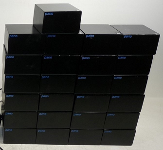

## Panologic building blocks

 

This is a collection of software and hardware modules for the Panologic thin 
client. The intent of this repository is that it be used as a git submodule by
other projects to avoid code [duplication](https://en.wikipedia.org/wiki/Don%27t_repeat_yourself).

If you don't know what a Panologic thin client then see [this](https://hackaday.com/2013/01/11/ask-hackaday-we-might-have-some-fpgas-to-hack/) 
article and refer to the [Pano Hacker's Wiki](https://github.com/tomverbeure/panologic-g2/wiki) for further reading.

## Projects using these blocks

- Skip's [OPL3 port](https://github.com/skiphansen/panog2_opl3) for the G2
- Skip's [NES Emulator](https://github.com/skiphansen/panog2_nes) project.
- Skip's [USB sniffer](https://github.com/skiphansen/panog2_usb_sniffer)

